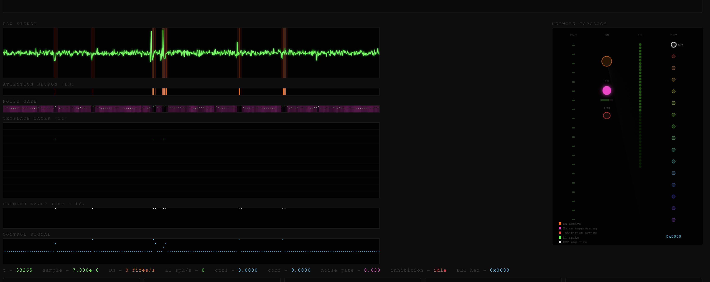

# ⚡ SNN Agent — Real-time Spike Sorting for Intracranial Recordings

**Turn raw electrode noise into sorted neural spikes — live, in your browser.**

<p align="center">
  
</p>

SNN Agent is a streaming spiking neural network that watches your electrode
signal and learns to detect, classify, and sort action potentials in real
time.  No training data required.  No manual template selection.  Plug in
your signal and watch it learn.

## Why SNN Agent?

| Problem | SNN Agent's Solution |
|---|---|
| Offline spike sorting delays your experiment by hours | Sorts spikes **in real time** as they arrive |
| Traditional sorters need hand-picked templates | The network **learns templates automatically** via competitive plasticity (STDP) |
| Noise floods your signal with false positives | A **Kalman-filter noise gate** and **post-spike inhibition** suppress noise while letting real spikes through |
| Closed-loop experiments need instant feedback | A **control decoder** converts sorted spikes into a control signal with sub-millisecond processing latency (sample-by-sample at 20 kHz) |
| Setup is complicated | One command to install, one command to run. **Browser GUI** with live raster, network topology, and tunable parameters |

## How it works

```
electrode → filter → encode → detect + gate → inhibit → sort → identify → decode
```

1. **Filter** — Bandpass cleans your signal (300 Hz – 6 kHz) and decimation
   drops the sample rate to a manageable 20 kHz.
2. **Encode** — Each sample is converted into a binary activation pattern —
   like a tiny image of the waveform's shape over time.
3. **Detect** — An attention neuron watches for moments when the signal
   energy rises above the noise floor.  It fires when something interesting
   happens.
4. **Gate** — A Kalman-filter noise gate runs in parallel, continuously
   estimating signal variance.  When variance is close to baseline noise,
   it suppresses downstream input — only letting real spikes through.
5. **Inhibit** — After any template neuron fires, a global inhibitor
   blanks all input for 5 ms (preventing double-counting), unless a strong
   signal breaks through.
6. **Sort** — Template neurons compete to match waveform shapes.
   Each neuron specialises through competitive STDP learning.  The best
   match wins (winner-take-all).
7. **Identify** — A 16-neuron DEC layer learns to associate template
   responses with distinct neural units.  Neuron 0 is a simple spike
   detector; neurons 1–15 learn unit identities via STDP.
8. **Decode** — Sorted spikes are converted into an output signal.  Five
   strategies are available:
   - **discrete** (default) — clean 1/0 per time step, ideal for spike sorting
   - **TTL** — fixed-width digital pulse (configurable width and level),
     suitable for driving hardware trigger lines
   - **trigger** — decaying exponential pulse with natural falloff
   - **rate** — sliding-window firing rate for continuous BCI control
   - **population** — leaky integrator with threshold crossing

Everything runs at 20 kHz with results streaming live to your browser.

> 📐 For the full mathematical specification, equations, pseudocode, and
> scientific basis, see **[Scientific Principles](docs/scientific_principles.md)**.

## Quick start

```bash
# 1. Install — requires uv (https://docs.astral.sh/uv/)
uv venv && source .venv/bin/activate
uv pip install -e ".[all,web]"

# 2. Start everything (pipeline server + browser dashboard)
./start.sh                                              # synthetic mode, 1 channel
./start.sh --channels 4 --config data/a_best_config.json

# 3. Open your browser
#    http://<server-ip>:8000/
```

`./start.sh` starts the SNN pipeline WebSocket server and the Django dashboard
together.  From the browser you can launch a **synthetic recording** or
**load a `.ncs` file** directly — no extra terminal needed.

> **SSH / remote box?**  `start.sh` prints the exact LAN URL to copy into
> your local browser when it starts.

### Remote UI (e.g. Jetson on the LAN)

The static page and WebSocket client use the **same host as the URL** you open
(`window.location.hostname`), so from a laptop browse to
`http://<device-ip>:8080` and the UI will connect to `ws://<device-ip>:8765` on
the machine running `snn-serve`. You can also copy `index.html` (and assets)
elsewhere and point the host at the agent if you prefer the browser not to load
from the device.

### Multichannel: performance and sensitivity

- **UI load**: When `n_channels > 1`, WebSocket updates are **capped** by
  `broadcast_max_hz_mc` (default 45 Hz) and `broadcast_every`; see
  `Config.multichannel_broadcast_stride()` in `config.py`. Increase the stride
  or lower `broadcast_max_hz_mc` if the CPU is saturated serializing JSON.
- **DEC visibility**: The DEC layer only integrates while the **DN attention
  gate** is open (see `dec.dn_window_ms` in `config.py`). Quiet DN → empty DEC
  raster is expected on unstructured noise.
- **Tuning (more sensitive outputs)**: `dec.any_fire_threshold`,
  `dec.unit_threshold_factor`, `dec.dn_window_ms`, `decoder.threshold` /
  strategy, `noise_gate.inhibit_below_sd`, and live **DN threshold** in the GUI.

### Remote UI (e.g. Jetson on the LAN)

The static page and WebSocket client use the **same host as the URL** you open
(`window.location.hostname`), so from a laptop browse to
`http://<device-ip>:8080` and the UI will connect to `ws://<device-ip>:8765` on
the machine running `snn-serve`. You can also copy `index.html` (and assets)
elsewhere and point the host at the agent if you prefer the browser not to load
from the device.

### Multichannel: performance and sensitivity

- **UI load**: When `n_channels > 1`, WebSocket updates are **capped** by
  `broadcast_max_hz_mc` (default 45 Hz) and `broadcast_every`; see
  `Config.multichannel_broadcast_stride()` in `config.py`. Increase the stride
  or lower `broadcast_max_hz_mc` if the CPU is saturated serializing JSON.
- **DEC visibility**: The DEC layer only integrates while the **DN attention
  gate** is open (see `dec.dn_window_ms` in `config.py`). Quiet DN → empty DEC
  raster is expected on unstructured noise.
- **Tuning (more sensitive outputs)**: `dec.any_fire_threshold`,
  `dec.unit_threshold_factor`, `dec.dn_window_ms`, `decoder.threshold` /
  strategy, `noise_gate.inhibit_below_sd`, and live **DN threshold** in the GUI.

## Input modes

SNN Agent accepts signal from three sources.  You can switch between
synthetic and file modes live from the browser.

| Mode | How to use |
|---|---|
| **Synthetic** | Click 🧪 SYNTHETIC in the browser dashboard (or `./start.sh --mode synthetic`) |
| **File (.ncs)** | Enter a file path in the browser launcher and click ▶ LOAD FILE |
| **LSL stream** | Start `snn-lsl data/raw/CSC285_0001.ncs` in a separate terminal, then `snn-serve` |
| **Electrode (UDP)** | Feed real samples to UDP port 9001: `snn-serve --mode electrode` |
| **Multi-Channel** | Run 8 channel: `snn-serve --mode synthetic --channels 8 --device cuda` |

### CLI commands

| Command | What it does |
|---|---|
| `./start.sh` | **Start everything** — pipeline server + Django dashboard (browser UI on port 8000) |
| `./start.sh --channels N` | Multi-channel mode (e.g. `--channels 4`) |
| `./start.sh --config data/a_best_config.json` | Load saved hyperparameters |
| `snn-serve` | Start pipeline WebSocket server only (no browser UI) |
| `snn-lsl <ncs_path>` | Replay a `.ncs` file over Lab Streaming Layer |
| `snn-test-electrode` | Synthetic UDP test signal generator |
| `snn-evaluate` | Offline pipeline evaluation against ground truth |
| `snn-optimize` | Optuna TPE hyperparameter search (Stage 1) |
| `snn-genetic` | Genetic crossover optimizer (Stage 2) |
| `snn-ground-truth` | Generate synthetic ground-truth recording |

## Browser dashboard

The live dashboard runs at `http://<server-ip>:8000` and shows:

- **Source launcher** — load files or start synthetic recordings without
  leaving the browser
- **Raw signal** oscilloscope with attention neuron and noise gate overlays
- **Spike raster** — 110-neuron template layer activity in real time
- **Control signal** trace with confidence indicator
- **Network topology** — animated diagram showing which neurons are firing,
  the noise gate state, and inhibition activity
- **Tunable parameters** — adjust DN threshold, STDP learning rates,
  inhibition, noise gate sensitivity, and output strategy live
- **Output control** — switch between discrete / TTL / trigger / rate /
  population strategies; configure TTL pulse width and level

## Architecture at a glance

```
┌─────────────────────────────────────────┐
│  Input: UDP / LSL / .ncs / synthetic    │
└──────────────┬──────────────────────────┘
               ▼
        ┌──────────────┐
        │ Preprocessor │  Bandpass 300–6 kHz + decimate ÷4
        └──────┬───────┘
               ▼
        ┌──────────────┐
        │ SpikeEncoder │  Temporal receptive field → binary vector
        └──────┬───────┘
          ┌────┴────┐
          ▼         ▼
    ┌──────────┐ ┌───────────┐
    │ Attention│ │ Noise Gate│  Excitatory + inhibitory gates
    │ Neuron   │ │ (Kalman)  │
    └────┬─────┘ └─────┬─────┘
         └──────┬──────┘
                ▼
        ┌───────────────┐
        │ Global Inhibit│  Post-spike blanking (5 ms)
        └───────┬───────┘
                ▼
        ┌───────────────┐
        │ Template Layer│  LIF neurons + WTA + STDP
        └───────┬───────┘
                ▼
        ┌───────────────┐
        │   DEC Layer   │  16 neurons: spike detection + unit ID
        └───────┬───────┘
                ▼
        ┌───────────────┐
        │    Decoder    │  → Control signal + UDP out
        └───────┬───────┘
           ┌────┴────┐
           ▼         ▼
      Experiment   Browser
      hardware     GUI
```

## Configuration

All parameters live in frozen dataclasses in `src/snn_agent/config.py`.
Override defaults with:

```python
from snn_agent.config import Config

cfg = Config()                                    # defaults (best trial)
cfg = Config.from_flat({"l1_n_neurons": 40})      # flat keys (Optuna)
cfg = cfg.with_overrides(sampling_rate_hz=30000)  # keyword overrides
```

## Hyperparameter optimisation

Two-stage automated search against SpikeInterface ground-truth synthetic
recordings:

```bash
# Stage 1 — Optuna TPE search
snn-optimize --n-trials 80

# Stage 2 — Genetic crossover of top trials
snn-genetic --top-k 10 --n-offspring 160

# Single evaluation run
snn-evaluate
```

**Evaluation methodology:**
- **4 synthetic scenarios** with varied seeds, noise levels, unit counts,
  and firing rates — prevents overfitting to one signal.
- **Train/test temporal split** — STDP learns during 0–15 s, scored on
  15–20 s only.
- **2.0 ms spike-matching tolerance** — 5× tighter than the typical 10 ms.
- **F₀.₅ objective** — precision-weighted metric that penalises false
  positives 2× more than missed spikes.

Results are saved to `data/best_config.json` and `data/trials.csv`
(or `data/genetic_trials.csv` for Stage 2).

> 📖 For the full methodology, search space, and interpretation guide,
> see **[Optimization Guide](docs/optimization_guide.md)**.

## Project structure

```
snn-agent/
├── pyproject.toml                  # Package definition & entry points
├── README.md                       # ← You are here
├── AGENTS.md                       # Machine-readable context map for AI agents
├── src/snn_agent/
│   ├── config.py                   # All parameters (frozen dataclasses)
│   ├── core/
│   │   ├── preprocessor.py         # Bandpass + decimation
│   │   ├── encoder.py              # Temporal RF spike encoder
│   │   ├── attention.py            # Attention neuron (DN)
│   │   ├── noise_gate.py           # Kalman noise suppressor
│   │   ├── inhibition.py           # Global post-spike inhibition
│   │   ├── template.py             # Template layer (L1) — LIF + STDP
│   │   ├── dec_layer.py            # Spiking decoder layer (DEC, 16 neurons)
│   │   ├── decoder.py              # Control decoder
│   │   └── pipeline.py             # Factory: builds the full chain
│   ├── server/
│   │   ├── app.py                  # Async server — WebSocket + UDP only (no HTTP)
│   │   └── static/index.html       # Legacy browser GUI (archived)
│   ├── eval/
│   │   ├── evaluate.py             # Offline scorer (SpikeInterface)
│   │   ├── optimize.py             # Optuna TPE hyperparameter search
│   │   ├── genetic.py              # Genetic crossover optimizer
│   │   └── ground_truth.py         # Synthetic ground-truth generation
│   └── io/
│       ├── lsl_player.py           # Replay .ncs over LSL
│       └── test_electrode.py       # Synthetic UDP signal generator
├── data/
│   ├── best_config.json            # Best optimisation result (params + metrics)
│   ├── trials.csv                  # Full Optuna history
│   ├── genetic_trials.csv          # Genetic optimizer history
│   └── raw/                        # Raw neural recordings (.ncs)
└── docs/
    ├── scientific_principles.md    # Full math, pseudocode & scientific basis
    ├── scientific_claims.md        # Independent audit of all scientific claims
    ├── optimization_guide.md       # Two-stage optimization reference
    ├── optimization_manifest.yaml  # Search space + evaluation config
    ├── annet_architecture.yaml     # Original ANNet design reference
    └── manifesto.json              # Machine-readable project contract
```

## Dependencies

**Core** (installed by default):
`numpy` · `scipy` · `torch` · `snntorch` · `websockets` · `pyyaml`

| Optional group | Install with | Adds |
|---|---|---|
| `lsl` | `uv pip install -e ".[lsl]"` | MNE, MNE-LSL (Lab Streaming Layer + .ncs file reading) |
| `eval` | `uv pip install -e ".[eval]"` | SpikeInterface, Optuna (evaluation & optimisation) |
| `all` | `uv pip install -e ".[all]"` | Everything above |
| `dev` | `uv pip install -e ".[dev]"` | + pytest, ruff (development) |

## Learn more

- **[Scientific Principles](docs/scientific_principles.md)** — full
  mathematical specification, pseudocode, plain-English explanations, and
  scientific basis with literature references.
- **[Scientific Claims Audit](docs/scientific_claims.md)** — independent
  evaluation of every scientific claim against the literature and code.
- **[Optimization Guide](docs/optimization_guide.md)** — two-stage
  optimization methodology, search space, metrics, and interpretation.
- **[Architecture Reference](docs/annet_architecture.yaml)** — detailed
  ANNet→Python porting decisions.
- **[Optimisation Manifest](docs/optimization_manifest.yaml)** — search
  space and evaluation configuration.

## License

MIT.  See `pyproject.toml` for details.
